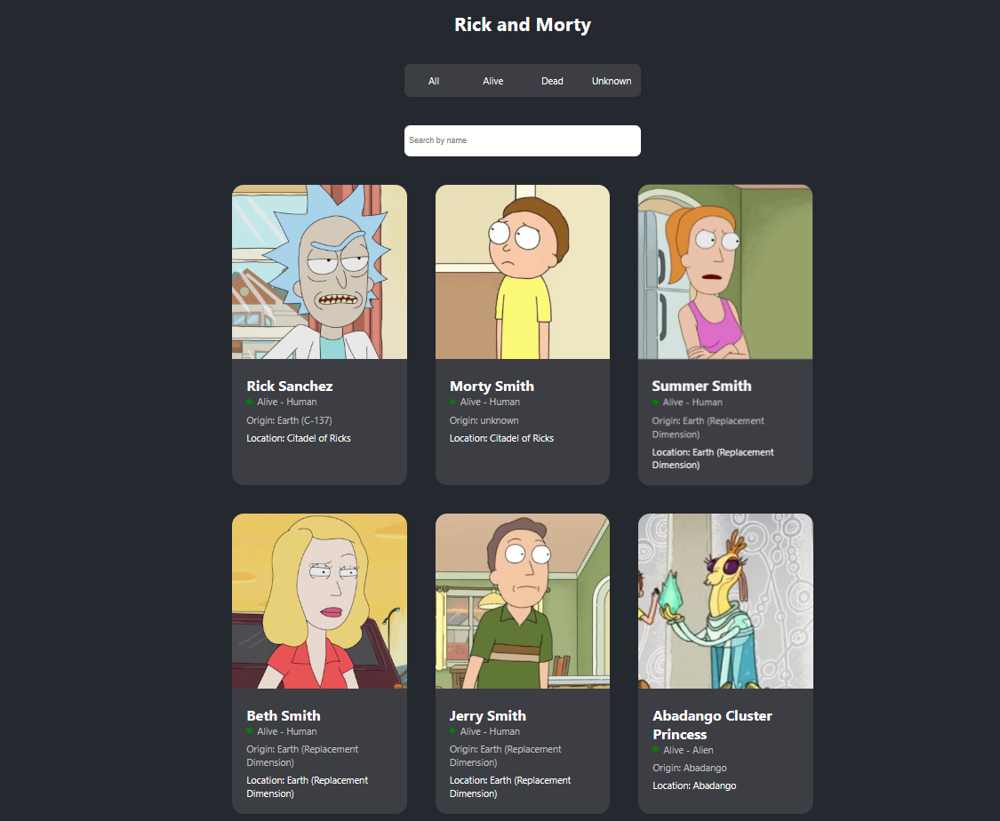

# Rick and Morty Vue App
Demo online: 🚀 [rick-and-morty-matt.netlify.app](https://rick-and-morty-matt.netlify.app/)


App web desarrollada con Vue.js que consume la API pública de Rick and Morty para mostrar personajes en tiempo real. Incluye filtros por estado y diseño responsive con SCSS. 🛸

## Tecnologías usadas

- Vue 3
- Vuex para manejo de estado
- SCSS para estilos
- API pública de Rick and Morty
- 


## Cómo instalar y correr el proyecto

1. Cloná el repo  
```bash
git clone https://github.com/MicaelaMarg/rick-and-morty.git
